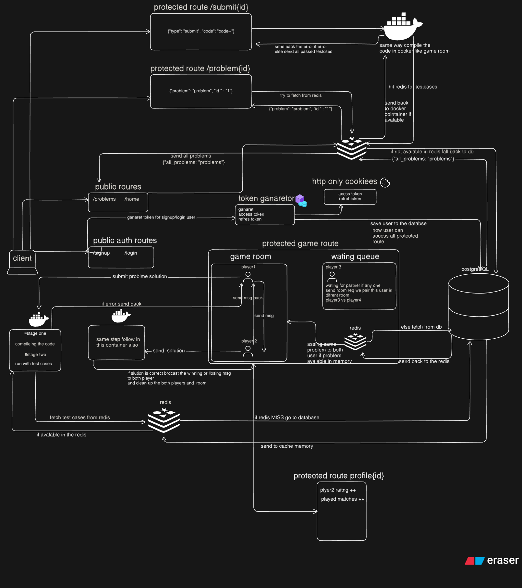

# ⚔️ CodeWar – Real-Time Competitive Programming Game (Backend)

**CodeWar** is a competitive programming platform — part **real-time multiplayer game**, part **solo LeetCode-style judge**. Two users can compete live on the same coding problem, or solve challenges individually.

Built with **Golang**, **PostgreSQL**, **Redis**, **WebSockets**, and **Docker**, CodeWar delivers a **blazingly fast**, secure, and isolated execution environment for every code submission using Docker containers.

---

## 📚 Index

- [🚀 Features](#-features)
- [🏗️ Architecture Overview](#-architecture-overview)
- [📁 Project Structure](#-project-structure)
- [🌐 API Routes](#-api-routes)
- [🧪 Code Execution Workflow](#-code-execution-workflow)
- [🧠 Game Logic](#-game-logic)
- [🐳 Docker & Scripts](#-docker--scripts)
- [🎥 Demo](#-demo)


---

## 🚀 Features

- 🔐 JWT Authentication (Access + Refresh tokens in HTTP-only cookies)
- 🧠 Real-time 1v1 Game via WebSocket (auto-matchmaking)
- 💬 In-game messaging between players (WebSocket chat)
- ⚡ Redis caching for fast problem access
- 🧪 Code execution in isolated Docker containers
- 🧾 Problem judge with Redis-first caching and PostgreSQL fallback
- 💳 Stripe integration to set user game limits
- 👤 User profiles with rating, solved problems, and history
- 🐳 Fully Dockerized and automated setup scripts
- 🧰 Built with clean architecture principles

---

## 🏗️ Architecture Overview




---

## 📁 Project Structure

```bash
Code_War/
.
├── cmd
│   └── main.go                        # Application entry point
├── docker-compose.yml                # Docker orchestration
├── Dockerfile                        # App Dockerfile
├── go.mod / go.sum                   # Go modules
├── init.sql                          # DB initialization
├── pkg                               # All core packages
│   ├── auth                          # JWT token management
│   ├── cppRuner                      # C++ code execution logic
│   ├── database                      # DB + Redis connection
│   ├── game                          # Game logic & matchmaking
│   ├── middleware                    # Protected route middleware
│   ├── modles                        # Data models (User, Problem, etc.)
│   ├── payment                       # Stripe integration
│   ├── routes                        # All HTTP/WebSocket route handlers
│   └── utils                         # Helper functions
├── README.md                         # You're reading it 🙂
├── signup_test.sh                    # Script to test signup
├── test_matchmaking.sh               # Script to test matchmaking and submit problem and chat msg in realtime
└── test_staticprobm.sh              # Script to test static problem judge 
...
```

---

## 🌐 API Routes

### 🔐 Public (Unprotected)

- **GET** `/home` — Landing page message
- **POST** `/signup` — Register a new user
- **POST** `/login` — Log in with credentials

### 🔒 Protected (JWT Auth Required)

- **GET** `/ws` — Start or join a 1v1 game (WebSocket)
- **GET** `/problems` — Get all available problems
- **GET** `/problem/:id` — Get a single problem by ID
- **POST** `/submit/:id` — Submit a solution to a problem
- **GET** `/profile/:id` — Get user profile, rating, and submission history
- **POST** `/logout` — Log out and clear session
- **POST** `/stripe/checkout` — Stripe payment integration

---

## 🧪 Code Execution Workflow

- Code is received from client
- Checked against Redis-first caching and PostgreSQL fallback
- Executed inside an isolated Docker container
- Compared against test cases
- Result returned instantly

---

## 🧠 Game Logic

- Users connect to `/websocketgame`
- If the **waiting queue is empty**, the user is added to the queue
- If another player connects and someone is already waiting, they are **matched instantly**
- Both users receive the **same coding problem**
- Players can **chat in real-time** (trash talk included 🙂)
- The **first to submit a correct solution wins**
- Game results are **broadcast to both players**

---

## 🐳 Docker & Scripts

Everything is containerized. Just clone and run:

```bash

# 1. Clone the repo
git clone https://github.com/iAmImran007/Code_War.git
cd Code_War


# 2. Adjust game limits
# Open the file below and change gameLimit to desired daily limit (e.g., 10)
 pkg/game/gameLimit.go
# Line 36: change from `return usage.GamesUsed < 1, nil` to your desired number


# 3. Start the full backend with Docker
docker compose up --build


# 4. Register test users
chmod +x ./signup_test.sh
./signup_test.sh


# 5. Install 'xterm' for simulating 2-user interaction 
sudo apt-get install xterm


# 6. Simulate a full 1v1 game with live chat + code submission
chmod +x ./test_matchmaking.sh
./test_matchmaking.sh

- chat format { "type": "chat", "text": "your message here" }
- code submission format { "type": "submit", "code": "your\ncode\nhere" }

# 7. Stop all containers
docker compose down -v

...
```

---

## 🎥 Demo

👉 [Demo](./Demo.png)

